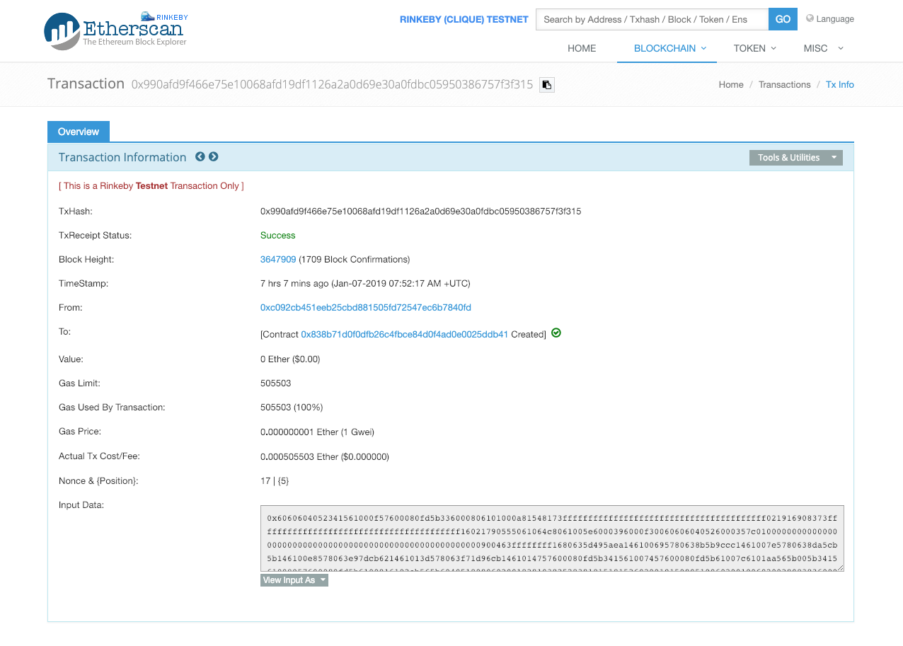
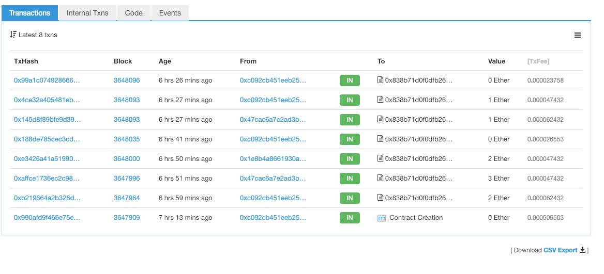

# 【project 阶段三】合约部署报告

15331197 林杰群

1. 项目简介

利用智能合约完成彩票的投注、开奖和发奖。

2. 智能合约内容

（1）定义玩家下注的功能

```javascript
function enter() public payable {
    require(msg.value > .0001 ether);  // 要求投注金额大于 0.001 ether
    
    players.push(msg.sender);
}
```

宣告下注函数 enter() 为公开，因为需要支付以太币，函数设为 payable。将这次交易的发起人加入 players 阵列，以便知道有多少名玩家。

（2）随机挑选赢家

```javascript
function random() private view returns(uint) {
    return uint(keccak256(block.difficulty, now, players));
}

modifier ownerOnly() {
    require(msg.sender == owner);  // pickWinner 只能由 owner 发起
    _;
}

function pickWinner() public ownerOnly {
    uint index = random() % players.length;
    players[index].transfer(this.balance);

    players = new address[](0);
}
```

利用 keccake256 这个特殊的 SHA 函数求值，带入 block.difficulty、目前时间和玩家阵列得到一个 hash 值，再转化为整数，以此随机挑选赢家。然后用 transfer 将奖金转给赢家。

modifier ownerOnly 的作用是规定只能由 owner 调用挑选赢家的函数。

详细代码见 contracts/Lottery.sol。

3. 合约部署

这里利用 RemixIDE 和 Rinkeby 来部署和测试合约。

在 RemixIDE 上部署合约 Lottery.sol，得到合约的地址：

.png)

由于要用到 Rinkeby 测试，所以 Environment 要选择 Injected Web3。本次部署得到的合约地址为：0x838b71d0f0dfb26c4fbce84d0f4ad0e0025ddb41。由此可以得到在 Rinkeby 测试网络上的链接：



可以看到合约的发起人是我的账户 0xC092cB451eEb25cBd881505FD72547ec6b7840fd，合约部署成功。通过查询也可以得到合约的交易情况：



